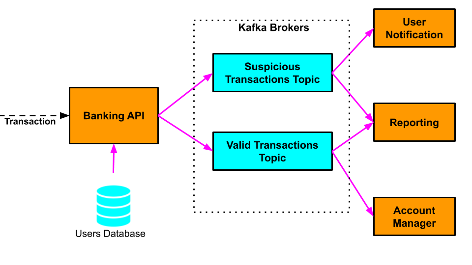

# Kafka Exercise from Udemy course: Banking System

Udemy course: [Distributed Systems & Cloud Computing with Java](https://www.udemy.com/course/distributed-systems-cloud-computing-with-java/?couponCode=KEEPLEARNING)

Author of course: Michael Pogrebinsky 

### Background
- Let's assume we have a large number of users. Each user has an account with our bank and was also issued a credit card to make purchases in stores.

- If our bank suspects a particular purchase transaction may be fraudulent, that transaction is flagged and sent to the user as a notification to approve or reject.

- The way our security detects suspicious transactions is by comparing the user's country of residence and the location from which the transaction was made. If the user's residence country and the transaction's location don't match, the transaction is flagged.

### Architecture

In our distributed system we will have multiple micro-services.

- **_Banking API Service_** - Receives credit card transactions from online and physical stores. Each transaction contains the following information

  1. User - the user who (allegedly) made the purchase in that particular store

  2. Amount - the amount of the purchase transaction in dollars

  3. Transaction location - the country in which that purchase has been made

- **_Users Database_** - A database where we store each of our bank users' residence location
- **_User Notification Service_** - for every transaction this service receives, it sends a notification to the user who allegedly made the purchase with a request to log in the banking web site and confirm or reject the transaction
- **_Account Manager Service_** - every transaction that this service receives is a valid transaction. The service authorizes the transaction and transfers the money from the user's account to the store where the purchase was made
- **_Reporting Service_** - For every transaction that has been processed by the Banking API Service, the Reporting Service stores the transaction for:
  1. Further investigation (if it is a suspicious transaction) or; 
  2. For the user's monthly statement (if it is a valid transaction)
